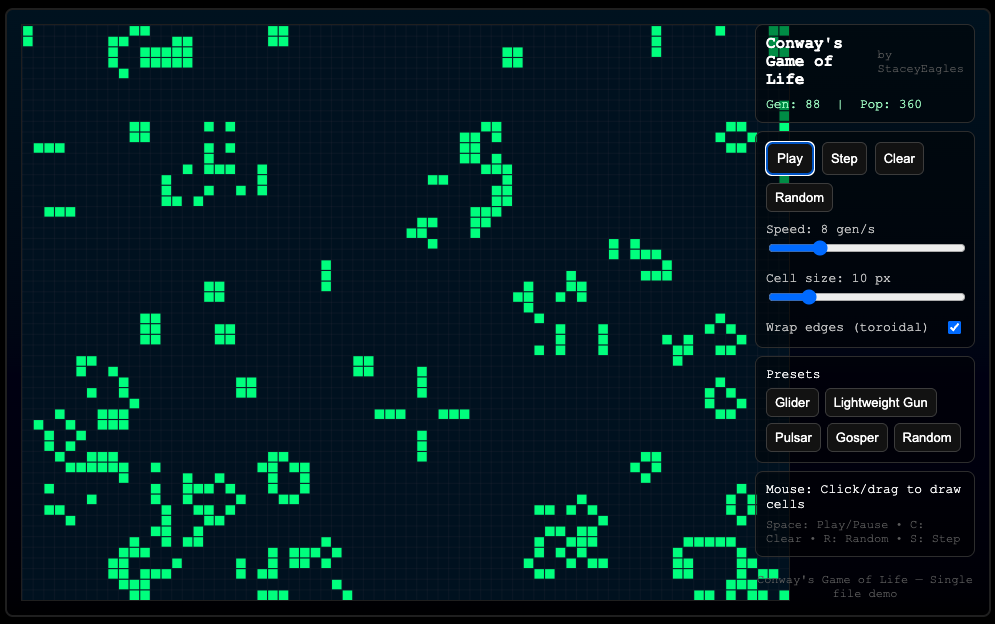

# conway's game of life



### User prompt

> **staceyeagles:** _Are you familiar with Conway's Game of Life?_

GitHub Copilot: I'll confirm I know Conway's Game of Life and offer next steps: I'll briefly summarize the rules and list ways I can help (implement, debug, or improve your life.html).

## Quick checklist
- Summarize rules — Done  
- Offer actionable help (implement/optimize/visualize in life.html) — Offered  
- Wait for your preference to proceed — Pending

## Short summary
Conway's Game of Life is a zero-player cellular automaton on a 2D grid where each cell is either alive or dead. Each generation updates synchronously using these rules:
- Any live cell with fewer than 2 live neighbors dies (underpopulation).
- Any live cell with 2 or 3 live neighbors lives on.
- Any live cell with more than 3 live neighbors dies (overpopulation).
- Any dead cell with exactly 3 live neighbors becomes alive (reproduction).

Common variants: finite grid vs. toroidal wrap, different neighborhoods, randomized starts, and optimizations (bitsets, sparse sets, canvas/WebGL for rendering).

What would you like me to do next? I can:
- Inspect and run/edit life.html and implement an interactive Game of Life.
- Add controls (start/stop/step/clear, speed, grid size, wrap).
- Optimize rendering (Canvas, requestAnimationFrame) or add patterns/examples.

### User prompt

> **staceyeagles:** _Yes, just like the lunar lander game (index.html) please create a single page HTML/javascript/css version of Life - in life.html_

GitHub Copilot: I'll add a single-file life.html that implements an interactive Conway's Game of Life with canvas rendering, controls (play/pause, step, clear, randomize, speed, grid size, wrap toggle), presets, click-and-drag editing, and a HUD sstaceyeagles: Are you familiar with Conway's game of life?

GitHub Copilot: I'll confirm I know Conway's Game of Life and offer next steps: I'll briefly summarize the rules and list ways I can help (implement, debug, or improve your life.html).

## Quick checklist
- Summarize rules — Done  
- Offer actionable help (implement/optimize/visualize in life.html) — Offered  
- Wait for your preference to proceed — Pending

## Short summary
Conway's Game of Life is a zero-player cellular automaton on a 2D grid where each cell is either alive or dead. Each generation updates synchronously using these rules:
- Any live cell with fewer than 2 live neighbors dies (underpopulation).
- Any live cell with 2 or 3 live neighbors lives on.
- Any live cell with more than 3 live neighbors dies (overpopulation).
- Any dead cell with exactly 3 live neighbors becomes alive (reproduction).

Common variants: finite grid vs. toroidal wrap, different neighborhoods, randomized starts, and optimizations (bitsets, sparse sets, canvas/WebGL for rendering).

What would you like me to do next? I can:
- Inspect and run/edit life.html and implement an interactive Game of Life.
- Add controls (start/stop/step/clear, speed, grid size, wrap).
- Optimize rendering (Canvas, requestAnimationFrame) or add patterns/examples.

staceyeagles: Yes, just like the lunar lander game (index.html) please create a single page HTML/javascript/css version of Life - in life.html

GitHub Copilot: I'll add a single-file life.html that implements an interactive Conway's Game of Life with canvas rendering, controls (play/pause, step, clear, randomize, speed, grid size, wrap toggle), presets, click-and-drag editing, and a HUD showing generation and population. I'll create the file now. 
```


Made changes.


```
Task receipt — I'll add a single-file interactive Conway's Game of Life at life.html, matching the Lunar Lander style and including play/pause, step, clear, random, speed and cell-size controls, wrap toggle, presets, and click-drag editing. I'll now summarize what I added and how to try it.

Checklist
- Create life.html — Done
- Canvas-based rendering with adjustable cell size — Done
- Play/Pause, Step, Clear, Random controls + keyboard shortcuts (Space/C/R/S) — Done
- Speed control (gen/s) and wrap edges toggle — Done
- Presets and click-drag editing — Done
- HUD for generation and population — Done

Files changed
- life.html — new single-file app implementing Conway's Game of Life (canvas, UI, presets, keyboard/mouse controls).

How to run (open in browser)
- Open life.html in your browser (double-click or serve the folder). It needs no build steps.

Notes / quick verification
- I initialized a random pattern and wired controls. Changing cell size reflows the grid (clears state to match new grid size). Speed controls the generations per second. Presets center patterns on the grid.
- If you'd like the grid to preserve relative positions when resizing, I can implement a scaling/translation step to keep the pattern — say if you prefer that behavior.
- I intentionally kept patterns lightweight to avoid large inline data; I can add standard patterns (Gosper Glider Gun full) if you want.

What next?
- I can add: more presets, pattern import/export (RLE), torus vs bounded animations, better performance for huge grids (bitsets/WebGL), or autosave state to localStorage. Tell me which to do next.

If you'd like, I can now run quick smoke checks (open the page in a local server) — say if you want me to start a simple HTTP server command for you to run.howing generation and population. I'll create the file now. 

...

[See also: life-agent-chat-sep-2-2025.md](life-agent-chat-sep-2-2025.md)